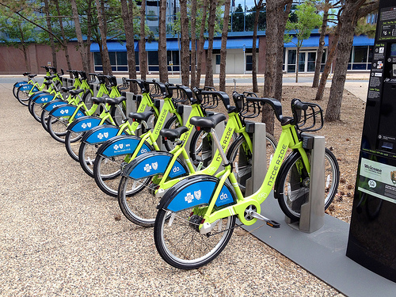

# My First Project in Machine Learning Foundation Nanodegree
# Data Analysis
## Project: Exploring US Bikeshare Data 

<p align="center"></p>

----

### Table Of Contents:
- [Description](#description)<br>
    - [About the project](#about-the-project)<br>
    - [What needs to be done](#what-needs-to-be-done)<br>
    - [Why this project](#why-this-project)<br>
- [Data](#data)<br>
    - [Files](#files)<br>
    - [Dataset file](#dataset-file)<br>
- [Loading Project](#loading-project)<br>
    - [Requirements](#requirements)<br>
    - [Execution](#execution)<br>
- [Conclusion](#conclusion)<br>
    - [What I learned](#what-i-learned)<br>
    - [Evaluation](#evaluation)
    - [Results](#results)

----

### Description

#### About the project

Over the past decade, bicycle-sharing systems have been growing in number and popularity in cities across the world. Bicycle-sharing systems allow users to rent bicycles for short trips, typically 30 minutes or less. Thanks to the rise in information technologies, it is easy for a user of the system to access a dock within the system to unlock or return bicycles. These technologies also provide a wealth of data that can be used to explore how these bike-sharing systems are used.

#### What needs to be done

In this project, I will perform an exploratory analysis on data provided by [Motivate](https://www.motivateco.com/)</a>, a bike-share system provider for many major cities in the United States. I will compare the system usage between three large cities:
- `New York City`
- `Chicago` 
- `Washington DC`.

I will also see if there are any differences within each system for those users that are registered, regular users and those users that are short-term, casual users. I will make use of Python(Pandas) to explore data and perform data wrangling to unify the format of data from the three systems and write code to compute descriptive statistics. I will also make use of a package that is not part of the standard Python library to help you visualize the data.

#### Why this project

If you are not familiar with the data analysis process, this project will be your first exposure to the kinds of steps that a data analyst takes when they approach a dataset. For now, all you need is the general python programming skills and a desire to learn about the data analysis process!

----

### Data

#### Files

This project contains 1 file and 2 folders:
- `US_Bike-Share_Analysis.ipynb`: This is the main file where I have performed my work on the project.
- `data/` : Folder containing 3 csv files of the cities that needs to be analyzed.
- `output/` : Folder containing clean data files.

Some code has already been implemented in `US_Bike-Share_Analysis notebook file` to get me started, I will need to implement additional functionality when requested to successfully complete the project. 

- `US_Bike-Share_Analysis.html` : HTML version of `US_Bike-Share_Analysis.ipynb` notebook file.
- `US_Bike-Share_Analysis.pdf` : PDF version of `US_Bike-Share_Analysis.ipynb` notebook file.

#### Dataset file

The data files for this analysis is in the `data/` folder containing three csv files of the cities to be analyzed. Each of these cities has a page where we can freely download the trip data.:

New York City (Citi Bike): [Link](https://www.citibikenyc.com/system-data)<br>
Chicago (Divvy): [Link](https://www.divvybikes.com/system-data)<br>
Washington DC (Capital Bikeshare): [Link](https://www.capitalbikeshare.com/system-data)<br>

While the original data for 2016 is spread among multiple files for each city, the files in the `data/` folder collect all of the trip data for the year into one file per city. Some data wrangling of inconsistencies in timestamp format within each city has already been performed. In addition, a random 2% sample of the original data is taken to make the exploration more manageable.

After data wrangling process of the data files, the files are then saved to `output/` folder.

-----

### Loading Project

#### Requirements

This project requires **Python 3** and the following Python libraries installed:

- [Python 3.6.5](https://www.python.org/downloads/release/python-365/)
- [NumPy](http://www.numpy.org/)
- [Pandas](http://pandas.pydata.org)
- [matplotlib](http://matplotlib.org/)
- [seaborn](https://seaborn.pydata.org/installing.html)

You will also need to have software installed to run and execute a [Jupyter Notebook](http://jupyter.org/install)

If you do not have Python installed yet, it is highly recommended that you install the [Anaconda](https://www.anaconda.com/download/) distribution of Python, which already has the above packages and more included. 

#### Execution

In a terminal or command window, navigate to the top-level project directory `US_Bike-Share_Activity/` (that contains this README) and run one of the following commands:

```bash
ipython notebook Finding_Donors.ipynb
```  
or
```bash
jupyter notebook Finding_Donors.ipynb
```

This will open the Jupyter/iPython Notebook software and project file in your browser.

-----

### Conclusion

#### What I learned

- How to load csv files in notebook using pandas.
- How to convert date and time to their appropriate format.
- Removing unnecessory rows and columns.
- Renaming Columns
- Visulaizing Data of a column of different files.
- Converting Dataframes to CSV files.


#### Evaluation
My project was reviewed by a Udacity reviewer against the **<a href="https://review.udacity.com/#!/projects/c028f7f5-1180-48dd-8921-736555242747/rubric" target="_blank">Explore US Bike-Share project rubric</a>**. All criteria found in the rubric must be *meeting specifications* for me to pass.

#### Results
[My Project Review by an Udacity Reviewer](https://review.udacity.com/#!/reviews/939794)

----